Mini Data Analysis Milestone 2
================

*To complete this milestone, you can either edit [this `.rmd`
file](https://raw.githubusercontent.com/UBC-STAT/stat545.stat.ubc.ca/master/content/mini-project/mini-project-2.Rmd)
directly. Fill in the sections that are commented out with
`<!--- start your work here--->`. When you are done, make sure to knit
to an `.md` file by changing the output in the YAML header to
`github_document`, before submitting a tagged release on canvas.*

# Welcome to the rest of your mini data analysis project!

In Milestone 1, you explored your data. and came up with research
questions. This time, we will finish up our mini data analysis and
obtain results for your data by:

- Making summary tables and graphs
- Manipulating special data types in R: factors and/or dates and times.
- Fitting a model object to your data, and extract a result.
- Reading and writing data as separate files.

We will also explore more in depth the concept of *tidy data.*

**NOTE**: The main purpose of the mini data analysis is to integrate
what you learn in class in an analysis. Although each milestone provides
a framework for you to conduct your analysis, it’s possible that you
might find the instructions too rigid for your data set. If this is the
case, you may deviate from the instructions – just make sure you’re
demonstrating a wide range of tools and techniques taught in this class.

# Instructions

**To complete this milestone**, edit [this very `.Rmd`
file](https://raw.githubusercontent.com/UBC-STAT/stat545.stat.ubc.ca/master/content/mini-project/mini-project-2.Rmd)
directly. Fill in the sections that are tagged with
`<!--- start your work here--->`.

**To submit this milestone**, make sure to knit this `.Rmd` file to an
`.md` file by changing the YAML output settings from
`output: html_document` to `output: github_document`. Commit and push
all of your work to your mini-analysis GitHub repository, and tag a
release on GitHub. Then, submit a link to your tagged release on canvas.

**Points**: This milestone is worth 50 points: 45 for your analysis, and
5 for overall reproducibility, cleanliness, and coherence of the Github
submission.

**Research Questions**: In Milestone 1, you chose two research questions
to focus on. Wherever realistic, your work in this milestone should
relate to these research questions whenever we ask for justification
behind your work. In the case that some tasks in this milestone don’t
align well with one of your research questions, feel free to discuss
your results in the context of a different research question.

# Learning Objectives

By the end of this milestone, you should:

- Understand what *tidy* data is, and how to create it using `tidyr`.
- Generate a reproducible and clear report using R Markdown.
- Manipulating special data types in R: factors and/or dates and times.
- Fitting a model object to your data, and extract a result.
- Reading and writing data as separate files.

# Setup

Begin by loading your data and the tidyverse package below:

``` r
library(datateachr) # <- might contain the data you picked!
library(tidyverse)
```

# Task 1: Process and summarize your data

From milestone 1, you should have an idea of the basic structure of your
dataset (e.g. number of rows and columns, class types, etc.). Here, we
will start investigating your data more in-depth using various data
manipulation functions.

### 1.1 (1 point)

First, write out the 4 research questions you defined in milestone 1
were. This will guide your work through milestone 2:

<!-------------------------- Start your work below ---------------------------->

1.  *How are tree species distributed across various neighborhoods and
    streets in Vancouver?*

2.  *Which tree species is predominant in each neighborhoods and streets
    in Vancouver*

3.  *Were there particular periods during which tree planting
    significantly increased in Vancouver*

4.  *Is there a discernible correlation between the diameter or height
    of trees and factors like the presence of a root barrier*

### 1.1.1 (Some comments)

1.  How many different tree species are there in each neighborhood and
    street?

2.  The second research question has been modified for enhanced
    graphical representation and clarity.

3.  Which tree species were primarily planted during these annual
    periods?

4.  The fourth research question has been refined for clearer graphical
    representation: I will initially examine any correlations between
    the diameter or height of trees and the presence of a root barrier.
    Subsequently, I will explore other factors.

<!----------------------------------------------------------------------------->

Here, we will investigate your data using various data manipulation and
graphing functions.

### 1.2 (8 points)

Now, for each of your four research questions, choose one task from
options 1-4 (summarizing), and one other task from 4-8 (graphing). You
should have 2 tasks done for each research question (8 total). Make sure
it makes sense to do them! (e.g. don’t use a numerical variables for a
task that needs a categorical variable.). Comment on why each task helps
(or doesn’t!) answer the corresponding research question.

Ensure that the output of each operation is printed!

Also make sure that you’re using dplyr and ggplot2 rather than base R.
Outside of this project, you may find that you prefer using base R
functions for certain tasks, and that’s just fine! But part of this
project is for you to practice the tools we learned in class, which is
dplyr and ggplot2.

**Summarizing:**

1.  Compute the *range*, *mean*, and *two other summary statistics* of
    **one numerical variable** across the groups of **one categorical
    variable** from your data.
2.  Compute the number of observations for at least one of your
    categorical variables. Do not use the function `table()`!
3.  Create a categorical variable with 3 or more groups from an existing
    numerical variable. You can use this new variable in the other
    tasks! *An example: age in years into “child, teen, adult, senior”.*
4.  Compute the proportion and counts in each category of one
    categorical variable across the groups of another categorical
    variable from your data. Do not use the function `table()`!

**Graphing:**

6.  Create a graph of your choosing, make one of the axes logarithmic,
    and format the axes labels so that they are “pretty” or easier to
    read.
7.  Make a graph where it makes sense to customize the alpha
    transparency.

Using variables and/or tables you made in one of the “Summarizing”
tasks:

8.  Create a graph that has at least two geom layers.
9.  Create 3 histograms, with each histogram having different sized
    bins. Pick the “best” one and explain why it is the best.

Make sure it’s clear what research question you are doing each operation
for!

<!------------------------- Start your work below ----------------------------->

``` r
# To have a general understanding of  vancouver_trees data set, 
# I will firstly use glimpse() to check its overall structure
glimpse(vancouver_trees)
```

    ## Rows: 146,611
    ## Columns: 20
    ## $ tree_id            <dbl> 149556, 149563, 149579, 149590, 149604, 149616, 149…
    ## $ civic_number       <dbl> 494, 450, 4994, 858, 5032, 585, 4909, 4925, 4969, 7…
    ## $ std_street         <chr> "W 58TH AV", "W 58TH AV", "WINDSOR ST", "E 39TH AV"…
    ## $ genus_name         <chr> "ULMUS", "ZELKOVA", "STYRAX", "FRAXINUS", "ACER", "…
    ## $ species_name       <chr> "AMERICANA", "SERRATA", "JAPONICA", "AMERICANA", "C…
    ## $ cultivar_name      <chr> "BRANDON", NA, NA, "AUTUMN APPLAUSE", NA, "CHANTICL…
    ## $ common_name        <chr> "BRANDON ELM", "JAPANESE ZELKOVA", "JAPANESE SNOWBE…
    ## $ assigned           <chr> "N", "N", "N", "Y", "N", "N", "N", "N", "N", "N", "…
    ## $ root_barrier       <chr> "N", "N", "N", "N", "N", "N", "N", "N", "N", "N", "…
    ## $ plant_area         <chr> "N", "N", "4", "4", "4", "B", "6", "6", "3", "3", "…
    ## $ on_street_block    <dbl> 400, 400, 4900, 800, 5000, 500, 4900, 4900, 4900, 7…
    ## $ on_street          <chr> "W 58TH AV", "W 58TH AV", "WINDSOR ST", "E 39TH AV"…
    ## $ neighbourhood_name <chr> "MARPOLE", "MARPOLE", "KENSINGTON-CEDAR COTTAGE", "…
    ## $ street_side_name   <chr> "EVEN", "EVEN", "EVEN", "EVEN", "EVEN", "ODD", "ODD…
    ## $ height_range_id    <dbl> 2, 4, 3, 4, 2, 2, 3, 3, 2, 2, 2, 5, 3, 2, 2, 2, 2, …
    ## $ diameter           <dbl> 10.00, 10.00, 4.00, 18.00, 9.00, 5.00, 15.00, 14.00…
    ## $ curb               <chr> "N", "N", "Y", "Y", "Y", "Y", "Y", "Y", "Y", "Y", "…
    ## $ date_planted       <date> 1999-01-13, 1996-05-31, 1993-11-22, 1996-04-29, 19…
    ## $ longitude          <dbl> -123.1161, -123.1147, -123.0846, -123.0870, -123.08…
    ## $ latitude           <dbl> 49.21776, 49.21776, 49.23938, 49.23469, 49.23894, 4…

``` r
vancouver_trees_age <- vancouver_trees %>%
  mutate(year_plant = as.numeric(format(date_planted, "%Y")), tree_age = 2023 - year_plant)
vancouver_trees_age
```

    ## # A tibble: 146,611 × 22
    ##    tree_id civic_number std_street    genus_name species_name cultivar_name  
    ##      <dbl>        <dbl> <chr>         <chr>      <chr>        <chr>          
    ##  1  149556          494 W 58TH AV     ULMUS      AMERICANA    BRANDON        
    ##  2  149563          450 W 58TH AV     ZELKOVA    SERRATA      <NA>           
    ##  3  149579         4994 WINDSOR ST    STYRAX     JAPONICA     <NA>           
    ##  4  149590          858 E 39TH AV     FRAXINUS   AMERICANA    AUTUMN APPLAUSE
    ##  5  149604         5032 WINDSOR ST    ACER       CAMPESTRE    <NA>           
    ##  6  149616          585 W 61ST AV     PYRUS      CALLERYANA   CHANTICLEER    
    ##  7  149617         4909 SHERBROOKE ST ACER       PLATANOIDES  COLUMNARE      
    ##  8  149618         4925 SHERBROOKE ST ACER       PLATANOIDES  COLUMNARE      
    ##  9  149619         4969 SHERBROOKE ST ACER       PLATANOIDES  COLUMNARE      
    ## 10  149625          720 E 39TH AV     FRAXINUS   AMERICANA    AUTUMN APPLAUSE
    ## # ℹ 146,601 more rows
    ## # ℹ 16 more variables: common_name <chr>, assigned <chr>, root_barrier <chr>,
    ## #   plant_area <chr>, on_street_block <dbl>, on_street <chr>,
    ## #   neighbourhood_name <chr>, street_side_name <chr>, height_range_id <dbl>,
    ## #   diameter <dbl>, curb <chr>, date_planted <date>, longitude <dbl>,
    ## #   latitude <dbl>, year_plant <dbl>, tree_age <dbl>

## **Research Question 01:** How are tree species distributed across various neighborhoods and streets in Vancouver?

**Summarizing task: Task 4: Compute the proportion and counts in each
category of one categorical variable across the groups of another
categorical variable from your data. Do not use the function
`table()`**.

- I will analyze the number and percentages of trees by species in each
  neighborhood and street.
- Additionally, I have calculated the counts and proportions of each
  species within every neighborhood and street.
- This analysis will be instrumental in addressing my research question,
  providing a clear perspective on the distribution of tree species
  across different neighborhoods and streets.

**Graphing task: Task 8: Create a graph that has at least two geom
layers**.

- I will utilize geom_bar to depict the counts and proportions of
  species within each neighborhood.
- Additionally, I have visualized the distribution of tree species by
  street.
- This is instrumental in addressing my research question, as it
  provides a clear representation of how tree species are distributed
  across different neighborhoods and streets.

``` r
#####################Summarizing task: Task 4  ############################
# summarizing how many species there are in this data set
# total number of tree species in  Vancouver
total_species_count <- n_distinct(vancouver_trees$species_name)
# there are 238 tree species in the City of Vancouver
total_species_count
```

    ## [1] 283

``` r
# Group tree for each neighborhood of each tree species
tree_species_per_neighborhoods <- vancouver_trees %>% group_by(neighbourhood_name, species_name)
# Check the number of trees for each tree species in every neighborhood
tree_species_per_neighborhoods_prop <-tree_species_per_neighborhoods %>% summarise(total_trees = n()) %>% mutate(prop = total_trees/sum(total_trees))
```

    ## `summarise()` has grouped output by 'neighbourhood_name'. You can override
    ## using the `.groups` argument.

``` r
tree_species_per_neighborhoods_prop
```

    ## # A tibble: 3,056 × 4
    ## # Groups:   neighbourhood_name [22]
    ##    neighbourhood_name species_name   total_trees     prop
    ##    <chr>              <chr>                <int>    <dbl>
    ##  1 ARBUTUS-RIDGE      ABIES                    2 0.000387
    ##  2 ARBUTUS-RIDGE      ACERIFOLIA   X         103 0.0199  
    ##  3 ARBUTUS-RIDGE      ACUTISSIMA               5 0.000967
    ##  4 ARBUTUS-RIDGE      ALNIFOLIA               16 0.00310 
    ##  5 ARBUTUS-RIDGE      AMERICANA              225 0.0435  
    ##  6 ARBUTUS-RIDGE      AQUIFOLIUM               3 0.000580
    ##  7 ARBUTUS-RIDGE      ARIA                    19 0.00368 
    ##  8 ARBUTUS-RIDGE      ARNOLDIANA X             4 0.000774
    ##  9 ARBUTUS-RIDGE      AUCUPARIA               16 0.00310 
    ## 10 ARBUTUS-RIDGE      AVIUM                   15 0.00290 
    ## # ℹ 3,046 more rows

``` r
# Check the number of species in every neighborhood
total_tree_species_per_neighborhoods <-  vancouver_trees %>% group_by(neighbourhood_name) %>% 
    summarize(total_species = n_distinct(species_name)) %>% 
    mutate(prop = total_species/total_species_count)
total_tree_species_per_neighborhoods
```

    ## # A tibble: 22 × 3
    ##    neighbourhood_name       total_species  prop
    ##    <chr>                            <int> <dbl>
    ##  1 ARBUTUS-RIDGE                      121 0.428
    ##  2 DOWNTOWN                            79 0.279
    ##  3 DUNBAR-SOUTHLANDS                  161 0.569
    ##  4 FAIRVIEW                           119 0.420
    ##  5 GRANDVIEW-WOODLAND                 146 0.516
    ##  6 HASTINGS-SUNRISE                   176 0.622
    ##  7 KENSINGTON-CEDAR COTTAGE           159 0.562
    ##  8 KERRISDALE                         138 0.488
    ##  9 KILLARNEY                          122 0.431
    ## 10 KITSILANO                          171 0.604
    ## # ℹ 12 more rows

``` r
# Group tree for each street of each tree species
tree_species_per_streets <- vancouver_trees %>% group_by(std_street, species_name)
# Check the number of tree for each tree species in every street
tree_species_per_street_prop <-tree_species_per_streets %>% summarise(total_trees = n()) %>% mutate(prop = total_trees/sum(total_trees))
```

    ## `summarise()` has grouped output by 'std_street'. You can override using the
    ## `.groups` argument.

``` r
tree_species_per_street_prop
```

    ## # A tibble: 18,154 × 4
    ## # Groups:   std_street [805]
    ##    std_street species_name total_trees   prop
    ##    <chr>      <chr>              <int>  <dbl>
    ##  1 ABBOTT ST  ACUTISSIMA             1 0.0159
    ##  2 ABBOTT ST  BILOBA                 2 0.0317
    ##  3 ABBOTT ST  CAMPESTRE             11 0.175 
    ##  4 ABBOTT ST  KOUSA                  7 0.111 
    ##  5 ABBOTT ST  PALUSTRIS              4 0.0635
    ##  6 ABBOTT ST  PLATANOIDES           25 0.397 
    ##  7 ABBOTT ST  SACCHARINUM            1 0.0159
    ##  8 ABBOTT ST  STYRACIFLUA           10 0.159 
    ##  9 ABBOTT ST  TRUNCATUM              1 0.0159
    ## 10 ABBOTT ST  TULIPIFERA             1 0.0159
    ## # ℹ 18,144 more rows

``` r
# Check the number of species in every street
total_tree_species_per_streets <-  vancouver_trees %>% group_by(std_street) %>% 
    summarize(total_species = n_distinct(species_name)) %>% 
    mutate(prop = total_species/total_species_count)
total_tree_species_per_streets
```

    ## # A tibble: 805 × 3
    ##    std_street   total_species    prop
    ##    <chr>                <int>   <dbl>
    ##  1 ABBOTT ST               10 0.0353 
    ##  2 ABERDEEN ST             12 0.0424 
    ##  3 ADANAC ST               50 0.177  
    ##  4 ADERA ST                42 0.148  
    ##  5 AISNE ST                 2 0.00707
    ##  6 ALAMEIN AV               5 0.0177 
    ##  7 ALBERNI ST              20 0.0707 
    ##  8 ALBERTA ST              44 0.155  
    ##  9 ALDER ST                 8 0.0283 
    ## 10 ALEXANDER ST            22 0.0777 
    ## # ℹ 795 more rows

``` r
##################### Graphing task: Task 8 ############################
ggplot(total_tree_species_per_neighborhoods, aes(x = neighbourhood_name, y = total_species)) +
  geom_bar(stat = "identity", fill = "steelblue", alpha = 0.7) + 
  geom_text(aes(label=total_species), vjust=-0.05) + # Adds a text layer to display the number of species
  labs(title = "Number of Tree Species per Neighborhood",
       y = "Total Number of Species",
       x = "Neighborhood Name") +
  theme_minimal() +
  theme(axis.text.x = element_text(angle = 45, hjust = 1))
```

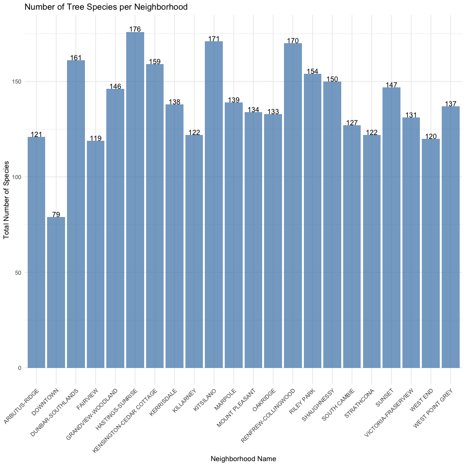<!-- -->

``` r
# Distribution of Tree Species per Street
ggplot(total_tree_species_per_streets, aes(x = total_species)) +
  geom_histogram(aes(y = ..density..), binwidth = 1, fill = "skyblue", alpha = 0.7) + 
  geom_density(color = "red", size = 1) +
  labs(title = "Distribution of Tree Species per Street",
       x = "Number of Tree Species",
       y = "Density") +
  theme_minimal()
```

    ## Warning: Using `size` aesthetic for lines was deprecated in ggplot2 3.4.0.
    ## ℹ Please use `linewidth` instead.
    ## This warning is displayed once every 8 hours.
    ## Call `lifecycle::last_lifecycle_warnings()` to see where this warning was
    ## generated.

    ## Warning: The dot-dot notation (`..density..`) was deprecated in ggplot2 3.4.0.
    ## ℹ Please use `after_stat(density)` instead.
    ## This warning is displayed once every 8 hours.
    ## Call `lifecycle::last_lifecycle_warnings()` to see where this warning was
    ## generated.

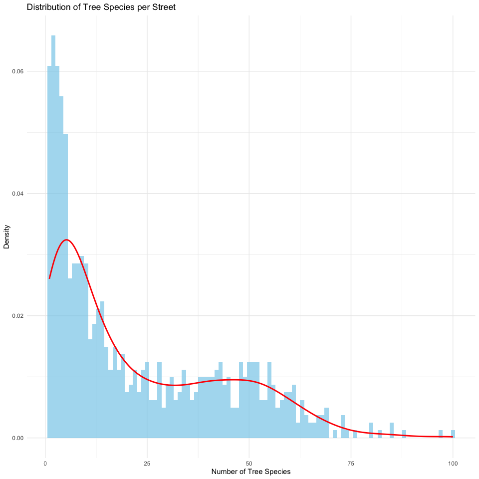<!-- -->

## **Research Question 02:** Which tree species is predominant in each neighborhoods and streets in Vancouver?

**Summarizing task: Task 2: Compute the number of observations for at
least one of your categorical variables. Do not use the function
`table()`**.

- I will determine the number of predominant tree species in each
  neighborhood and street.
- This information is crucial for my research, as it provides a clear
  insight into which tree species are most prevalent in various
  neighborhoods and streets of Vancouver.

**Graphing task: Task 7: Create 3 histograms, with each histogram having
different sized bins. Pick the “best” one and explain why it is the
best**.

- I will employ geom_bar to depict the dominant species in each
  neighborhood.
- This visualization is crucial for addressing my research query as it
  directly showcases the dominant species in every neighborhood.
- A larger bin size is preferable as it condenses the graph, offering a
  clearer view to users.

``` r
#####################Summarizing task: Task 3  ############################
predominant_species_of_each_neighbourhood <- vancouver_trees %>%
  group_by(neighbourhood_name, species_name) %>%
  summarise(count = n()) %>%
  arrange(neighbourhood_name, -count) %>%
  slice(1) %>%
  select(neighbourhood_name, species_name, count)
```

    ## `summarise()` has grouped output by 'neighbourhood_name'. You can override
    ## using the `.groups` argument.

``` r
predominant_species_of_each_neighbourhood
```

    ## # A tibble: 22 × 3
    ## # Groups:   neighbourhood_name [22]
    ##    neighbourhood_name       species_name count
    ##    <chr>                    <chr>        <int>
    ##  1 ARBUTUS-RIDGE            CERASIFERA     895
    ##  2 DOWNTOWN                 RUBRUM        1019
    ##  3 DUNBAR-SOUTHLANDS        PLATANOIDES   1165
    ##  4 FAIRVIEW                 RUBRUM         567
    ##  5 GRANDVIEW-WOODLAND       SERRULATA      583
    ##  6 HASTINGS-SUNRISE         CERASIFERA     972
    ##  7 KENSINGTON-CEDAR COTTAGE SERRULATA     1002
    ##  8 KERRISDALE               PLATANOIDES   1067
    ##  9 KILLARNEY                EUCHLORA   X   676
    ## 10 KITSILANO                PLATANOIDES   1188
    ## # ℹ 12 more rows

``` r
predominant_species_of_each_street <- vancouver_trees %>%
  group_by(std_street, species_name) %>%
  summarise(count = n()) %>%
  arrange(std_street, -count) %>%
  slice(1) %>%
  select(std_street, species_name, count)
```

    ## `summarise()` has grouped output by 'std_street'. You can override using the
    ## `.groups` argument.

``` r
predominant_species_of_each_street
```

    ## # A tibble: 805 × 3
    ## # Groups:   std_street [805]
    ##    std_street   species_name   count
    ##    <chr>        <chr>          <int>
    ##  1 ABBOTT ST    PLATANOIDES       25
    ##  2 ABERDEEN ST  FLORIBUNDA        19
    ##  3 ADANAC ST    PSEUDOPLATANUS    39
    ##  4 ADERA ST     PLATANOIDES      119
    ##  5 AISNE ST     ZUMI               4
    ##  6 ALAMEIN AV   CERASIFERA        18
    ##  7 ALBERNI ST   EUCHLORA   X      52
    ##  8 ALBERTA ST   HIPPOCASTANUM     43
    ##  9 ALDER ST     PSEUDOPLATANUS     7
    ## 10 ALEXANDER ST RUBRUM            32
    ## # ℹ 795 more rows

``` r
##################### Graphing task: Task 8 ############################
# Histogram 1: Small bin width
hist1 <- ggplot(predominant_species_of_each_neighbourhood, aes(x = neighbourhood_name, y = count, label = species_name)) +
  geom_bar(stat = 'identity', fill = "skyblue", alpha = 0.7, width = 0.25) +
  geom_text(aes(label=species_name), vjust=-0.5, size = 2) +
  labs(title = "Histogram 1: Small Bin Width",
       x = "Neighbourhood Name",
       y = "Count of Predominant Species Trees") +
  theme_minimal() +
  theme(axis.text.x = element_text(angle = 45, hjust=1))

# Histogram 2: Medium bin width
hist2 <- ggplot(predominant_species_of_each_neighbourhood, aes(x = neighbourhood_name, y = count, label = species_name)) +
  geom_bar(stat = 'identity', fill = "lightgreen", alpha = 0.7, width = 0.5) +
  geom_text(aes(label=species_name), vjust=-0.5, size = 2) +
  labs(title = "Histogram 2: Medium Bin Width",
       x = "Neighbourhood Name",
       y = "Count of Predominant Species Trees") +
  theme_minimal() +
  theme(axis.text.x = element_text(angle = 45, hjust=1))

# Histogram 3: Large bin width
hist3 <- ggplot(predominant_species_of_each_neighbourhood, aes(x = neighbourhood_name, y = count, label = species_name)) +
  geom_bar(stat = 'identity', fill = "lightpink", alpha = 0.7, width = 0.7) +
  geom_text(aes(label=species_name), vjust=-0.5, size =2) +
  labs(title = "Histogram 3: Large Bin Width",
       x = "Neighbourhood Name",
       y = "Count of Predominant Species Trees") +
  theme_minimal() +
  theme(axis.text.x = element_text(angle = 45, hjust=1))

## Create a slice of predominant_species_of_each_street of 20 rows
predominant_species_of_each_street_first_20 <- head(predominant_species_of_each_street, 20)

# Histogram 4: Small bin width
hist4 <-ggplot(predominant_species_of_each_street_first_20, aes(x = std_street, y = count, label = species_name)) +
  geom_bar(stat = 'identity', fill = "skyblue", alpha = 0.7, width = 0.25) +
  geom_text(aes(label=species_name), vjust=-0.5, size = 2) +
  labs(title = "Histogram 1: Small Bin Width",
       x = "Street Name",
       y = "Count of Predominant Species Trees") +
  theme_minimal() +
  theme(axis.text.x = element_text(angle = 45, hjust=1))

# Histogram 5: Medium bin width
hist5 <- ggplot(predominant_species_of_each_street_first_20, aes(x = std_street, y = count, label = species_name)) +
  geom_bar(stat = 'identity', fill = "lightgreen", alpha = 0.7, width = 0.5) +
  geom_text(aes(label=species_name), vjust=-0.5, size = 2) +
  labs(title = "Histogram 2: Medium Bin Width",
       x = "Street Name",
       y = "Count of Predominant Species Trees") +
  theme_minimal() +
  theme(axis.text.x = element_text(angle = 45, hjust=1))

# Histogram 6: Large bin width
hist6 <- ggplot(predominant_species_of_each_street_first_20, aes(x = std_street, y = count, label = species_name)) +
  geom_bar(stat = 'identity', fill = "lightpink", alpha = 0.7, width = 0.7) +
  geom_text(aes(label=species_name), vjust=-0.5, size = 2) +
  labs(title = "Histogram 3: Large Bin Width",
       x = "Street Name",
       y = "Count of Predominant Species Trees") +
  theme_minimal() +
  theme(axis.text.x = element_text(angle = 45, hjust=1))

print(hist1)
```

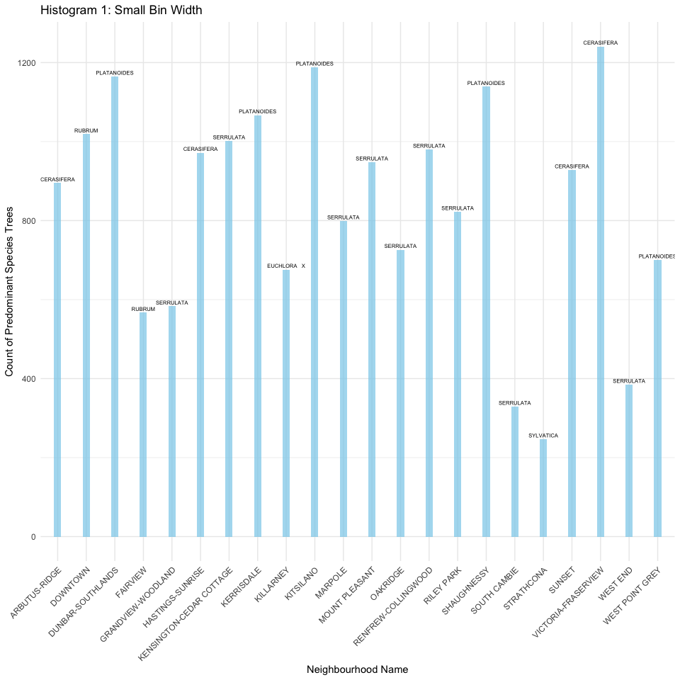<!-- -->

``` r
print(hist2)
```

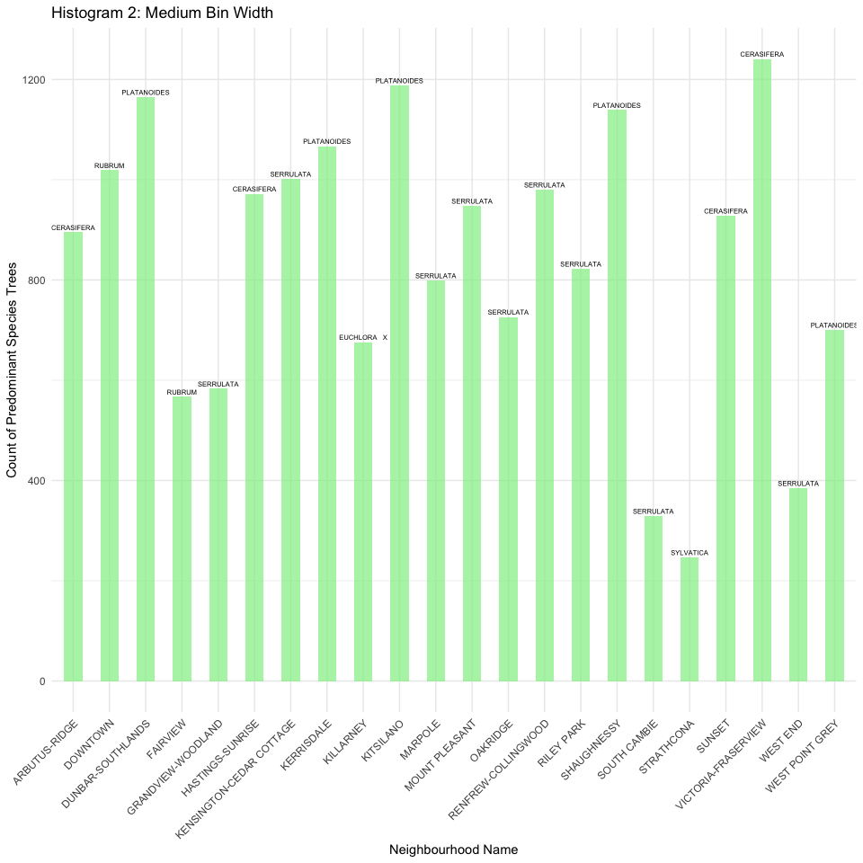<!-- -->

``` r
print(hist3)
```

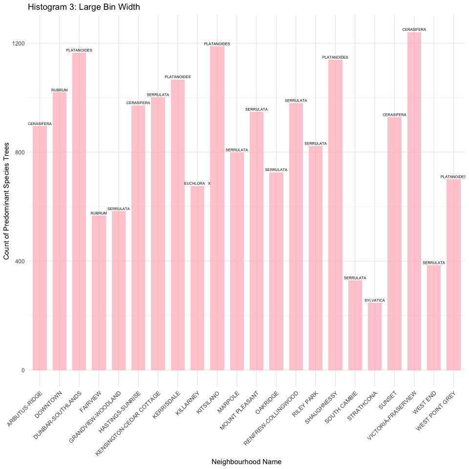<!-- -->

``` r
print(hist4)
```

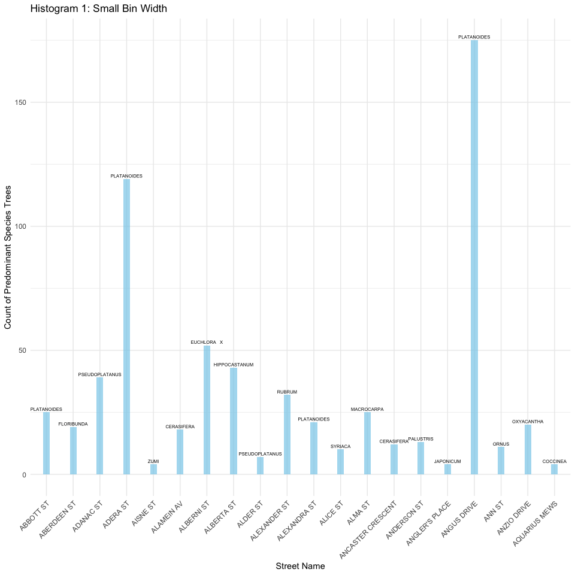<!-- -->

``` r
print(hist5)
```

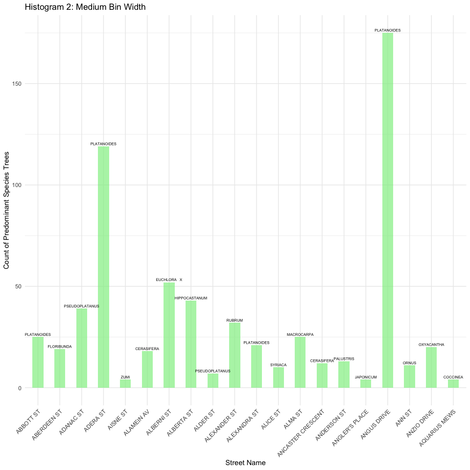<!-- -->

``` r
print(hist6)
```

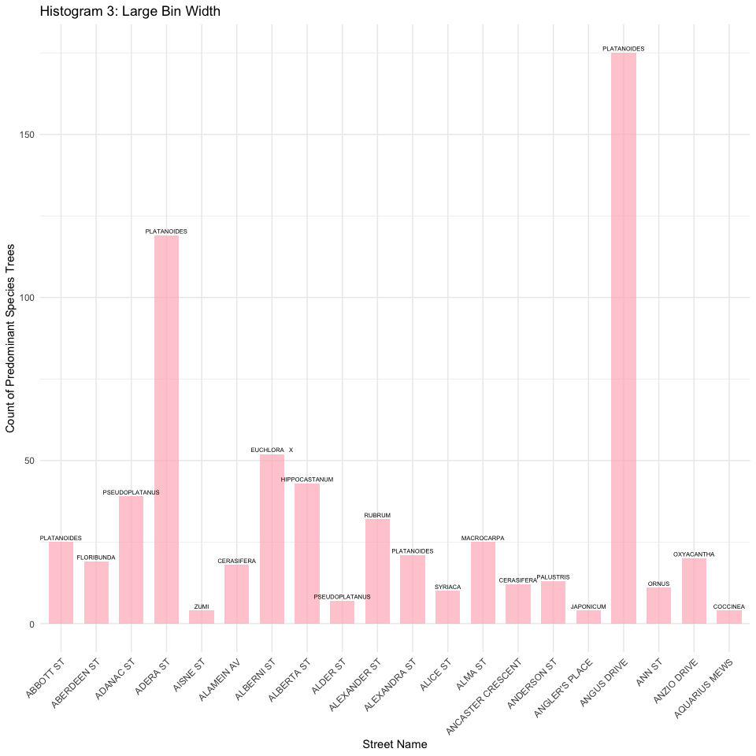<!-- -->

## **Research Question 03:** Were there particular periods during which tree planting significantly increased in Vancouver?

**Summarizing task: Task 1: Compute the range, mean, and two other
summary statistics of one numerical variable across the groups of one
categorical variable from your data**.

- I will determine the annual tree planting count in Vancouver.
- Subsequently, I will compute the range, mean, standard deviation, and
  median of trees planted, categorized by street_side_name.
- This analysis will be instrumental in addressing my research question,
  providing a clear perspective on Vancouver’s tree planting efforts and
  revealing the contribution of each street_side annually.

**Graphing task: Task 8:Create a graph that has at least two geom
layers**.

- I will employ geom_point to depict the annual tree planting activities
  in Vancouver.
- This visualization will be instrumental in addressing my research
  question, offering a clear representation of yearly tree planting in
  Vancouver.

``` r
#####################Summarizing task: Task 3  ############################
# Remove rows where Year_Column is NA
vancouver_trees_age_clean <- vancouver_trees_age %>% filter(!is.na(year_plant))

# Group by Year_Column to get the count of trees planted each year
tree_planting_per_year <- vancouver_trees_age_clean %>%
  group_by(year_plant) %>%
  summarise(num_trees_planted = n())
tree_planting_per_year
```

    ## # A tibble: 31 × 2
    ##    year_plant num_trees_planted
    ##         <dbl>             <int>
    ##  1       1989               300
    ##  2       1990              1145
    ##  3       1991               579
    ##  4       1992              1759
    ##  5       1993              2128
    ##  6       1994              1879
    ##  7       1995              2912
    ##  8       1996              3079
    ##  9       1997              2778
    ## 10       1998              3581
    ## # ℹ 21 more rows

``` r
tree_planting_with_street_side_per_year <- vancouver_trees_age_clean %>%
  group_by(year_plant, street_side_name) %>%
  summarise(num_trees_planted = n())
```

    ## `summarise()` has grouped output by 'year_plant'. You can override using the
    ## `.groups` argument.

``` r
tree_planting_with_street_side_per_year
```

    ## # A tibble: 99 × 3
    ## # Groups:   year_plant [31]
    ##    year_plant street_side_name num_trees_planted
    ##         <dbl> <chr>                        <int>
    ##  1       1989 EVEN                           168
    ##  2       1989 ODD                            132
    ##  3       1990 EVEN                           581
    ##  4       1990 MED                              3
    ##  5       1990 ODD                            561
    ##  6       1991 EVEN                           292
    ##  7       1991 ODD                            287
    ##  8       1992 EVEN                           844
    ##  9       1992 MED                              1
    ## 10       1992 ODD                            914
    ## # ℹ 89 more rows

``` r
summary_stats <- tree_planting_with_street_side_per_year %>%
  summarise(
    range = max(num_trees_planted) - min(num_trees_planted),
    mean = mean(num_trees_planted),
    median = median(num_trees_planted),
    sd = sd(num_trees_planted)
  )
summary_stats
```

    ## # A tibble: 31 × 5
    ##    year_plant range  mean median     sd
    ##         <dbl> <int> <dbl>  <dbl>  <dbl>
    ##  1       1989    36  150    150   25.5 
    ##  2       1990   578  382.   561  328.  
    ##  3       1991     5  290.   290.   3.54
    ##  4       1992   913  586.   844  508.  
    ##  5       1993  1069  709.  1047  609.  
    ##  6       1994   931  626.   890  518.  
    ##  7       1995  1443  971.  1441  829.  
    ##  8       1996  1545 1026.  1486  869.  
    ##  9       1997  1238  926   1334  713.  
    ## 10       1998  1459 1194.  1612  815.  
    ## # ℹ 21 more rows

``` r
# Plot
p1 <- ggplot(tree_planting_per_year, aes(x = year_plant, y = num_trees_planted)) +
  geom_line(color = "blue", size = 1) + 
  geom_point(color = "red", size = 2) +
  geom_text(aes(label = year_plant), vjust = -0.5, size = 3) +
  labs(title = "Tree Planting Trend in Vancouver Over the Years",
       x = "Year of Planting",
       y = "Number of Trees Planted") +
  theme_minimal()

print(p1)
```

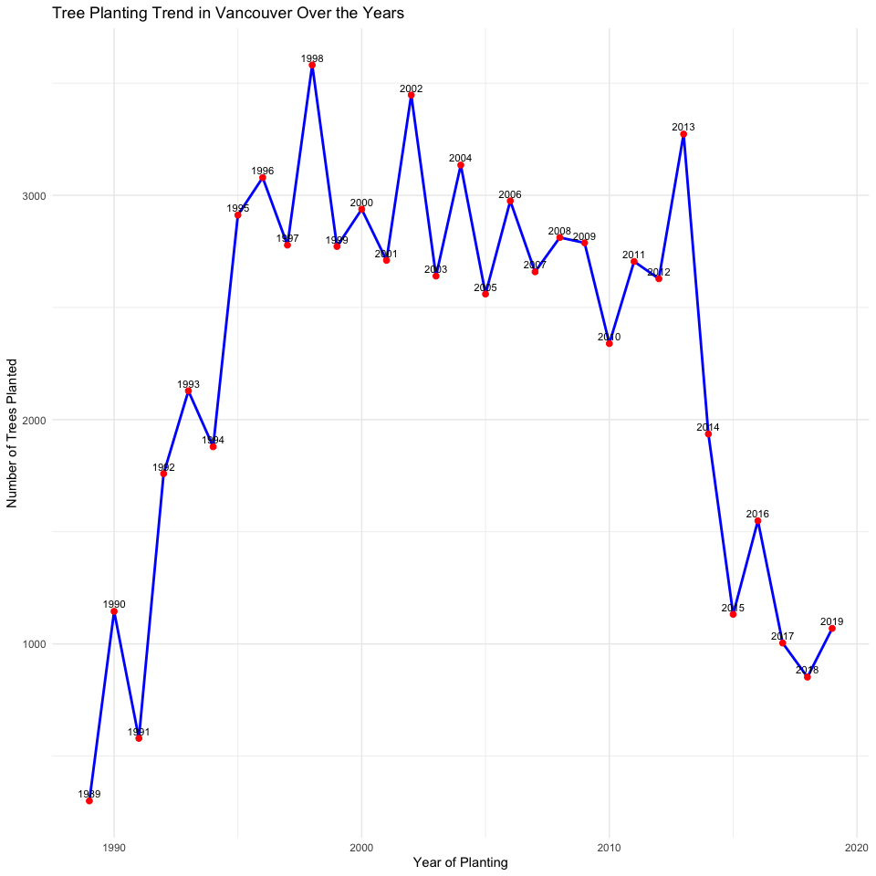<!-- -->

## **Research Question 04:** Does the tree with a root barrier have a long diameter and higher height in general?

**Summarizing task: Task 1: Compute the range, mean, and two other
summary statistics of one numerical variable across the groups of one
categorical variable from your data**.

- I need to analyze the average diameter and height of trees with a root
  barrier in comparison to those without one using the vancouver_trees
  data set.
- This is advantageous as it provides a statistical perspective on the
  height and diameter associated with the root barrier.

**Graphing task: Task 8: Create a graph that has at least two geom
layers**.

- I will create a bar chart that displays the average diameter and
  height for each root barrier group.
- By visualizing these metrics, users can make informed decisions about
  implementing or re-evaluating root barriers, considering their
  potential impact on tree growth.

``` r
#####################Summarizing task: Task 3  ############################
# Remove rows where Year_Column is NA
# Summarize data by presence of root barrier
tree_stats <- vancouver_trees %>%
  group_by(root_barrier) %>%
  summarise(
    mean_diameter = mean(diameter, na.rm = TRUE),
    mean_height = mean(height_range_id, na.rm = TRUE)
  )
tree_stats
```

    ## # A tibble: 2 × 3
    ##   root_barrier mean_diameter mean_height
    ##   <chr>                <dbl>       <dbl>
    ## 1 N                    12.0         2.72
    ## 2 Y                     4.40        1.30

``` r
# Melt the data for easier plotting
tree_stats_long <- pivot_longer(tree_stats, c(mean_diameter, mean_height), names_to = "measure", values_to = "value")
tree_stats_long
```

    ## # A tibble: 4 × 3
    ##   root_barrier measure       value
    ##   <chr>        <chr>         <dbl>
    ## 1 N            mean_diameter 12.0 
    ## 2 N            mean_height    2.72
    ## 3 Y            mean_diameter  4.40
    ## 4 Y            mean_height    1.30

``` r
# Plot
ggplot(tree_stats_long, aes(x = root_barrier, y = value, fill = measure)) +
  geom_bar(stat = "identity", position = "dodge") +
  geom_text(aes(label = sprintf("%.2f", value)), position = position_dodge(width = 0.9), vjust = -0.5) +
  labs(title = "Comparison of Mean Diameter and Height with/without Root Barrier",
       y = "Value",
       x = "Root Barrier Presence") +
  theme_minimal()
```

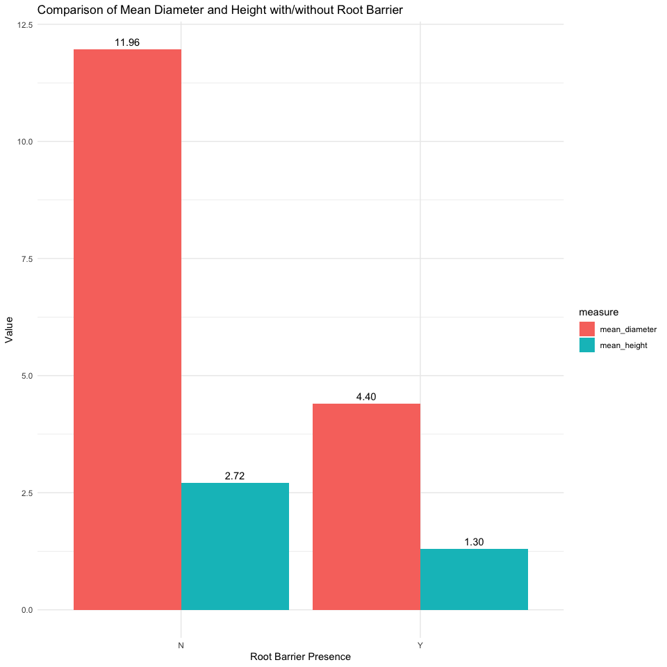<!-- -->

<!----------------------------------------------------------------------------->

### 1.3 (2 points)

Based on the operations that you’ve completed, how much closer are you
to answering your research questions? Think about what aspects of your
research questions remain unclear. Can your research questions be
refined, now that you’ve investigated your data a bit more? Which
research questions are yielding interesting results?

<!------------------------- Write your answer here ---------------------------->

### Research Question 1: How are tree species distributed across various neighborhoods and streets in Vancouver?

- I’ve successfully mapped out the distribution of tree species across
  neighborhoods and streets in Vancouver by creating a detailed tibble.
- Visual representations, such as plots, further illustrate this
  distribution, providing clarity on concentrations in specific
  neighborhoods and streets.
- To delve deeper, a geographical heat-map on a map of Vancouver could
  provide a visual representation of the distribution of tree species by
  location.

### Research Question 2: Which tree species is predominant in each neighborhoods and streets in Vancouver?

- By analyzing the data, I have identified the most predominant tree
  species in every neighborhood and street in Vancouver.
- The visual plots created offer a snapshot of the most frequently found
  tree species across these areas.
- Moving forward, it would be insightful to identify which neighborhoods
  lack diversity in tree species, and which species are exclusive to
  specific areas.

### Research Question 3: Were there particular periods during which tree planting significantly increased in Vancouver?

- The data has been organized year-wise to highlight the number of trees
  planted annually in Vancouver.
- The plots vividly depict fluctuations in tree planting activities over
  the years, pointing out significant surges.
- A deeper analysis could involve understanding the reasons behind these
  surges. This could be tied to city policies, environmental campaigns,
  or other socio-economic factors.

### Research Question 4: Is there a discernible correlation between the diameter or height of trees and factors like the presence of a root barrier, street side, curb or ages(date of plant)

- Preliminary data suggests a correlation between tree dimensions
  (diameter and height) and the presence of root barriers.
- The visuals generated support this observation by presenting
  noticeable differences in dimensions in trees with and without root
  barriers.
- As a subsequent step, I aim to explore potential correlations between
  tree dimensions and other factors such as street side, proximity to
  the curb, and the age of the tree. Regression models or correlation
  matrices might be used to further investigate these relationships.

<!----------------------------------------------------------------------------->

# Task 2: Tidy your data

In this task, we will do several exercises to reshape our data. The goal
here is to understand how to do this reshaping with the `tidyr` package.

A reminder of the definition of *tidy* data:

- Each row is an **observation**
- Each column is a **variable**
- Each cell is a **value**

### 2.1 (2 points)

Based on the definition above, can you identify if your data is tidy or
untidy? Go through all your columns, or if you have \>8 variables, just
pick 8, and explain whether the data is untidy or tidy.

<!--------------------------- Start your work below --------------------------->

``` r
#select 8 variables
glimpse(vancouver_trees)
```

    ## Rows: 146,611
    ## Columns: 20
    ## $ tree_id            <dbl> 149556, 149563, 149579, 149590, 149604, 149616, 149…
    ## $ civic_number       <dbl> 494, 450, 4994, 858, 5032, 585, 4909, 4925, 4969, 7…
    ## $ std_street         <chr> "W 58TH AV", "W 58TH AV", "WINDSOR ST", "E 39TH AV"…
    ## $ genus_name         <chr> "ULMUS", "ZELKOVA", "STYRAX", "FRAXINUS", "ACER", "…
    ## $ species_name       <chr> "AMERICANA", "SERRATA", "JAPONICA", "AMERICANA", "C…
    ## $ cultivar_name      <chr> "BRANDON", NA, NA, "AUTUMN APPLAUSE", NA, "CHANTICL…
    ## $ common_name        <chr> "BRANDON ELM", "JAPANESE ZELKOVA", "JAPANESE SNOWBE…
    ## $ assigned           <chr> "N", "N", "N", "Y", "N", "N", "N", "N", "N", "N", "…
    ## $ root_barrier       <chr> "N", "N", "N", "N", "N", "N", "N", "N", "N", "N", "…
    ## $ plant_area         <chr> "N", "N", "4", "4", "4", "B", "6", "6", "3", "3", "…
    ## $ on_street_block    <dbl> 400, 400, 4900, 800, 5000, 500, 4900, 4900, 4900, 7…
    ## $ on_street          <chr> "W 58TH AV", "W 58TH AV", "WINDSOR ST", "E 39TH AV"…
    ## $ neighbourhood_name <chr> "MARPOLE", "MARPOLE", "KENSINGTON-CEDAR COTTAGE", "…
    ## $ street_side_name   <chr> "EVEN", "EVEN", "EVEN", "EVEN", "EVEN", "ODD", "ODD…
    ## $ height_range_id    <dbl> 2, 4, 3, 4, 2, 2, 3, 3, 2, 2, 2, 5, 3, 2, 2, 2, 2, …
    ## $ diameter           <dbl> 10.00, 10.00, 4.00, 18.00, 9.00, 5.00, 15.00, 14.00…
    ## $ curb               <chr> "N", "N", "Y", "Y", "Y", "Y", "Y", "Y", "Y", "Y", "…
    ## $ date_planted       <date> 1999-01-13, 1996-05-31, 1993-11-22, 1996-04-29, 19…
    ## $ longitude          <dbl> -123.1161, -123.1147, -123.0846, -123.0870, -123.08…
    ## $ latitude           <dbl> 49.21776, 49.21776, 49.23938, 49.23469, 49.23894, 4…

``` r
tidy_trees <- vancouver_trees %>% 
  select(c(tree_id, civic_number, std_street, cultivar_name, common_name, date_planted, longitude, latitude))
glimpse(tidy_trees)
```

    ## Rows: 146,611
    ## Columns: 8
    ## $ tree_id       <dbl> 149556, 149563, 149579, 149590, 149604, 149616, 149617, …
    ## $ civic_number  <dbl> 494, 450, 4994, 858, 5032, 585, 4909, 4925, 4969, 720, 7…
    ## $ std_street    <chr> "W 58TH AV", "W 58TH AV", "WINDSOR ST", "E 39TH AV", "WI…
    ## $ cultivar_name <chr> "BRANDON", NA, NA, "AUTUMN APPLAUSE", NA, "CHANTICLEER",…
    ## $ common_name   <chr> "BRANDON ELM", "JAPANESE ZELKOVA", "JAPANESE SNOWBELL", …
    ## $ date_planted  <date> 1999-01-13, 1996-05-31, 1993-11-22, 1996-04-29, 1993-12…
    ## $ longitude     <dbl> -123.1161, -123.1147, -123.0846, -123.0870, -123.0846, -…
    ## $ latitude      <dbl> 49.21776, 49.21776, 49.23938, 49.23469, 49.23894, 49.215…

Based on the definition above, I will pick **tree_id**,
**civic_number**, **std_street**, **cultivar_names**, **common_name**,
**date_planted**, **longitude**, **latitude** 8 variables.

Overall, the data adheres to the principles of tidy data. However, there
are some missing values (NAs) within the std_street, cultivar_names,
date_planted, longitude, latitude categories. Nonetheless, the data set
consistently ensures that each row represents an observation, each
column signifies a variable, and each cell contains a single value

All of the columns are variables, and all of their contents are values.
Hence, tidy data.
<!----------------------------------------------------------------------------->

### 2.2 (4 points)

Now, if your data is tidy, untidy it! Then, tidy it back to it’s
original state.

If your data is untidy, then tidy it! Then, untidy it back to it’s
original state.

Be sure to explain your reasoning for this task. Show us the “before”
and “after”.

<!--------------------------- Start your work below --------------------------->

``` r
# Convert the tidy data into untidy data by combining the species_name and cultivar_name
tidy_to_untidy <- vancouver_trees %>% pivot_longer(cols = c("species_name", "cultivar_name"), 
               names_to  = "types_of_taxonomy", 
               values_to = "name")
print(tidy_to_untidy)
```

    ## # A tibble: 293,222 × 20
    ##    tree_id civic_number std_street genus_name common_name  assigned root_barrier
    ##      <dbl>        <dbl> <chr>      <chr>      <chr>        <chr>    <chr>       
    ##  1  149556          494 W 58TH AV  ULMUS      BRANDON ELM  N        N           
    ##  2  149556          494 W 58TH AV  ULMUS      BRANDON ELM  N        N           
    ##  3  149563          450 W 58TH AV  ZELKOVA    JAPANESE ZE… N        N           
    ##  4  149563          450 W 58TH AV  ZELKOVA    JAPANESE ZE… N        N           
    ##  5  149579         4994 WINDSOR ST STYRAX     JAPANESE SN… N        N           
    ##  6  149579         4994 WINDSOR ST STYRAX     JAPANESE SN… N        N           
    ##  7  149590          858 E 39TH AV  FRAXINUS   AUTUMN APPL… Y        N           
    ##  8  149590          858 E 39TH AV  FRAXINUS   AUTUMN APPL… Y        N           
    ##  9  149604         5032 WINDSOR ST ACER       HEDGE MAPLE  N        N           
    ## 10  149604         5032 WINDSOR ST ACER       HEDGE MAPLE  N        N           
    ## # ℹ 293,212 more rows
    ## # ℹ 13 more variables: plant_area <chr>, on_street_block <dbl>,
    ## #   on_street <chr>, neighbourhood_name <chr>, street_side_name <chr>,
    ## #   height_range_id <dbl>, diameter <dbl>, curb <chr>, date_planted <date>,
    ## #   longitude <dbl>, latitude <dbl>, types_of_taxonomy <chr>, name <chr>

``` r
# Convert the untidy data into tidy data
untidy_to_tidy_original <-tidy_to_untidy %>% 
  pivot_wider(names_from  = "types_of_taxonomy", values_from = "name")
print(untidy_to_tidy_original)
```

    ## # A tibble: 146,611 × 20
    ##    tree_id civic_number std_street  genus_name common_name assigned root_barrier
    ##      <dbl>        <dbl> <chr>       <chr>      <chr>       <chr>    <chr>       
    ##  1  149556          494 W 58TH AV   ULMUS      BRANDON ELM N        N           
    ##  2  149563          450 W 58TH AV   ZELKOVA    JAPANESE Z… N        N           
    ##  3  149579         4994 WINDSOR ST  STYRAX     JAPANESE S… N        N           
    ##  4  149590          858 E 39TH AV   FRAXINUS   AUTUMN APP… Y        N           
    ##  5  149604         5032 WINDSOR ST  ACER       HEDGE MAPLE N        N           
    ##  6  149616          585 W 61ST AV   PYRUS      CHANTICLEE… N        N           
    ##  7  149617         4909 SHERBROOKE… ACER       COLUMNAR N… N        N           
    ##  8  149618         4925 SHERBROOKE… ACER       COLUMNAR N… N        N           
    ##  9  149619         4969 SHERBROOKE… ACER       COLUMNAR N… N        N           
    ## 10  149625          720 E 39TH AV   FRAXINUS   AUTUMN APP… N        N           
    ## # ℹ 146,601 more rows
    ## # ℹ 13 more variables: plant_area <chr>, on_street_block <dbl>,
    ## #   on_street <chr>, neighbourhood_name <chr>, street_side_name <chr>,
    ## #   height_range_id <dbl>, diameter <dbl>, curb <chr>, date_planted <date>,
    ## #   longitude <dbl>, latitude <dbl>, species_name <chr>, cultivar_name <chr>

``` r
#Part B: Untidy Data to Tidy Data 
tidy_to_drop_na_tidy_data <- vancouver_trees %>% drop_na()
print(tidy_to_drop_na_tidy_data)
```

    ## # A tibble: 41,859 × 20
    ##    tree_id civic_number std_street    genus_name species_name cultivar_name  
    ##      <dbl>        <dbl> <chr>         <chr>      <chr>        <chr>          
    ##  1  149556          494 W 58TH AV     ULMUS      AMERICANA    BRANDON        
    ##  2  149590          858 E 39TH AV     FRAXINUS   AMERICANA    AUTUMN APPLAUSE
    ##  3  149617         4909 SHERBROOKE ST ACER       PLATANOIDES  COLUMNARE      
    ##  4  149618         4925 SHERBROOKE ST ACER       PLATANOIDES  COLUMNARE      
    ##  5  149619         4969 SHERBROOKE ST ACER       PLATANOIDES  COLUMNARE      
    ##  6  149625          720 E 39TH AV     FRAXINUS   AMERICANA    AUTUMN APPLAUSE
    ##  7  149640         6968 SELKIRK ST    ACER       PLATANOIDES  COLUMNARE      
    ##  8  149673         5241 WINDSOR ST    FRAXINUS   OXYCARPA     RAYWOOD        
    ##  9  149683         7011 SELKIRK ST    ACER       PLATANOIDES  COLUMNARE      
    ## 10  149684         1223 W 54TH AV     ACER       PLATANOIDES  COLUMNARE      
    ## # ℹ 41,849 more rows
    ## # ℹ 14 more variables: common_name <chr>, assigned <chr>, root_barrier <chr>,
    ## #   plant_area <chr>, on_street_block <dbl>, on_street <chr>,
    ## #   neighbourhood_name <chr>, street_side_name <chr>, height_range_id <dbl>,
    ## #   diameter <dbl>, curb <chr>, date_planted <date>, longitude <dbl>,
    ## #   latitude <dbl>

<!----------------------------------------------------------------------------->

### 2.3 (4 points)

Now, you should be more familiar with your data, and also have made
progress in answering your research questions. Based on your interest,
and your analyses, pick 2 of the 4 research questions to continue your
analysis in the remaining tasks:

<!-------------------------- Start your work below ---------------------------->

1.  *Were there particular periods during which tree planting
    significantly increased in Vancouver*
2.  *Is there a discernible correlation between the diameter or height
    of trees and factors like the presence of a root barrier*

<!----------------------------------------------------------------------------->

Explain your decision for choosing the above two research questions.

<!--------------------------- Start your work below --------------------------->

1.  Investigating Tree Planting Trends in Neighborhoods The initial
    investigation revealed intriguing patterns in tree planting, with
    certain years witnessing a more pronounced inclination towards
    afforestation. This piqued my curiosity: while the broader trend was
    evident, did individual neighborhoods mirror this pattern or did
    they exhibit unique trends of their own? Understanding the
    micro-trends at the neighborhood level can offer insights into
    localized factors or initiatives that might be driving or inhibiting
    tree planting. This could be instrumental in tailoring
    community-specific strategies to promote green initiatives.

2.  Factors Influencing Tree Growth While the impact of root barriers on
    tree diameter and height has been established, it’s essential to
    delve deeper and uncover other potential factors influencing tree
    growth. Trees don’t just grow in isolation; they are influenced by a
    myriad of environmental, biological, and human-induced factors. By
    identifying these factors, we can pinpoint neighborhoods that offer
    conducive environments for tree growth. This knowledge can guide
    urban planning decisions, ensuring that trees planted today grow
    tall and robust, contributing to a greener urban landscape in the
    future.
    <!----------------------------------------------------------------------------->

Now, try to choose a version of your data that you think will be
appropriate to answer these 2 questions. Use between 4 and 8 functions
that we’ve covered so far (i.e. by filtering, cleaning, tidy’ing,
dropping irrelevant columns, etc.).

(If it makes more sense, then you can make/pick two versions of your
data, one for each research question.)

<!--------------------------- Start your work below --------------------------->

### Further Investigation on Research Question 01

``` r
# Group by Year_Column and neighborhood to get the count of trees planted each year for each neighborhood
tree_planting_per_year_per_neighbourhood <- vancouver_trees_age_clean %>%
  group_by(year_plant, neighbourhood_name) %>%
  summarise(tree_count = n())
```

    ## `summarise()` has grouped output by 'year_plant'. You can override using the
    ## `.groups` argument.

``` r
tree_planting_per_year_per_neighbourhood
```

    ## # A tibble: 671 × 3
    ## # Groups:   year_plant [31]
    ##    year_plant neighbourhood_name       tree_count
    ##         <dbl> <chr>                         <int>
    ##  1       1989 ARBUTUS-RIDGE                    41
    ##  2       1989 DOWNTOWN                          6
    ##  3       1989 DUNBAR-SOUTHLANDS                65
    ##  4       1989 GRANDVIEW-WOODLAND               26
    ##  5       1989 KENSINGTON-CEDAR COTTAGE          7
    ##  6       1989 KERRISDALE                        2
    ##  7       1989 KILLARNEY                        30
    ##  8       1989 MARPOLE                           6
    ##  9       1989 MOUNT PLEASANT                    4
    ## 10       1989 RENFREW-COLLINGWOOD              45
    ## # ℹ 661 more rows

``` r
summary_stats <- tree_planting_per_year_per_neighbourhood %>%
  group_by(neighbourhood_name) %>%
  summarise(
    tree_count_max = max(tree_count),
    tree_count_min = min(tree_count),
    tree_count_range = tree_count_max - tree_count_min,
    max_tree_year_plant = year_plant[which.max(tree_count)],
    min_tree__year_plant = year_plant[which.min(tree_count)],
    tree_count_mean = mean(tree_count),
    tree_count_std_dev = sd(tree_count),
    tree_count_median = median(tree_count)
  )

summary_stats
```

    ## # A tibble: 22 × 9
    ##    neighbourhood_name       tree_count_max tree_count_min tree_count_range
    ##    <chr>                             <int>          <int>            <int>
    ##  1 ARBUTUS-RIDGE                       305             16              289
    ##  2 DOWNTOWN                            250              1              249
    ##  3 DUNBAR-SOUTHLANDS                   272             24              248
    ##  4 FAIRVIEW                            128              1              127
    ##  5 GRANDVIEW-WOODLAND                  288             13              275
    ##  6 HASTINGS-SUNRISE                    415             56              359
    ##  7 KENSINGTON-CEDAR COTTAGE            561              7              554
    ##  8 KERRISDALE                          261              2              259
    ##  9 KILLARNEY                           240             13              227
    ## 10 KITSILANO                           197              9              188
    ## # ℹ 12 more rows
    ## # ℹ 5 more variables: max_tree_year_plant <dbl>, min_tree__year_plant <dbl>,
    ## #   tree_count_mean <dbl>, tree_count_std_dev <dbl>, tree_count_median <dbl>

``` r
p1 <- ggplot(tree_planting_per_year_per_neighbourhood, aes(x = year_plant, y = tree_count, color = neighbourhood_name)) +
  geom_line() +
  labs(title = "Tree Planting Trends by Neighborhood in Vancouver",
       x = "Year",
       y = "Number of Trees Planted") +
  theme_minimal() +
  theme(legend.position="none")  # you can remove this line if you want the legend to be displayed
print(p1)
```

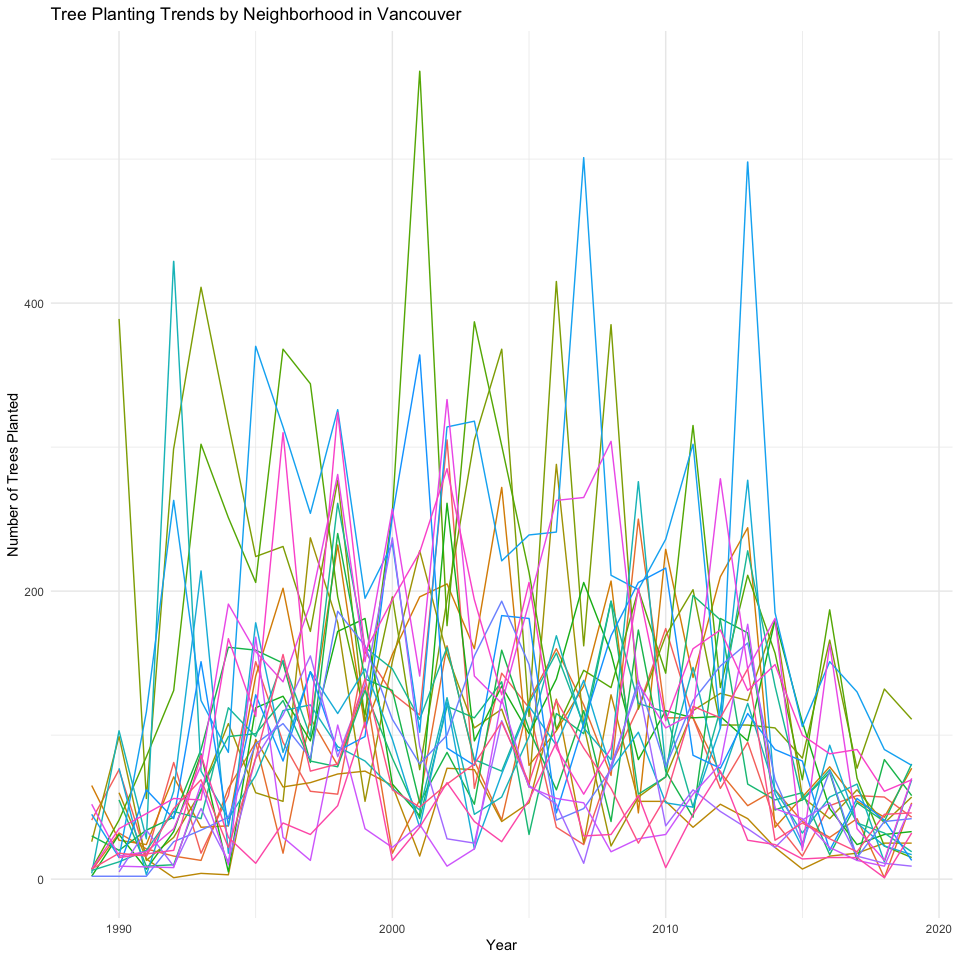<!-- -->

### Further Investigation on Research Question 02

``` r
# Is there a discernible correlation between the diameter or height of trees and factors like the presence of street side, curb or ages(date of plant)
tree_growth_stats <- vancouver_trees_age %>%
  select(tree_id, curb, street_side_name, tree_age, diameter,height_range_id)

# stat for curb
tree_growth_curb_stats <- tree_growth_stats %>% group_by(curb) %>%
  summarise(
    mean_diameter = mean(diameter, na.rm = TRUE),
    mean_height = mean(height_range_id, na.rm = TRUE)
  )
tree_growth_curb_stats
```

    ## # A tibble: 2 × 3
    ##   curb  mean_diameter mean_height
    ##   <chr>         <dbl>       <dbl>
    ## 1 N              12.6        2.79
    ## 2 Y              11.4        2.61

``` r
# stat for street_side_name
tree_growth_street_side_stats <- tree_growth_stats %>% group_by(street_side_name) %>%
  summarise(
    mean_diameter = mean(diameter, na.rm = TRUE),
    mean_height = mean(height_range_id, na.rm = TRUE)
  )
tree_growth_street_side_stats
```

    ## # A tibble: 6 × 3
    ##   street_side_name mean_diameter mean_height
    ##   <chr>                    <dbl>       <dbl>
    ## 1 BIKE MED                  3.01        1.32
    ## 2 EVEN                     11.5         2.61
    ## 3 GREENWAY                 16.4         3.4 
    ## 4 MED                       8.08        1.96
    ## 5 ODD                      11.7         2.68
    ## 6 PARK                      3.19        1.05

``` r
# stat for year_plant
tree_growth_age_stats <- tree_growth_stats %>% group_by(tree_age) %>%
  summarise(
    mean_diameter = mean(diameter, na.rm = TRUE),
    mean_height = mean(height_range_id, na.rm = TRUE)
  )
tree_growth_age_stats
```

    ## # A tibble: 32 × 3
    ##    tree_age mean_diameter mean_height
    ##       <dbl>         <dbl>       <dbl>
    ##  1        4          3.07        1.02
    ##  2        5          3.07        1.02
    ##  3        6          3.05        1.05
    ##  4        7          3.11        1.03
    ##  5        8          3.21        1.06
    ##  6        9          3.19        1.05
    ##  7       10          3.25        1.05
    ##  8       11          3.46        1.06
    ##  9       12          3.48        1.12
    ## 10       13          3.63        1.10
    ## # ℹ 22 more rows

``` r
# Ploting
# Melt the data for easier plotting to curb
tree_stats_growth_curb_long <- pivot_longer(tree_growth_curb_stats, c(mean_diameter, mean_height), 
                                names_to = "measure", values_to = "value")
tree_stats_growth_curb_long
```

    ## # A tibble: 4 × 3
    ##   curb  measure       value
    ##   <chr> <chr>         <dbl>
    ## 1 N     mean_diameter 12.6 
    ## 2 N     mean_height    2.79
    ## 3 Y     mean_diameter 11.4 
    ## 4 Y     mean_height    2.61

``` r
# Plot
ggplot(tree_stats_growth_curb_long, aes(x = curb, y = value, fill = measure)) +
  geom_bar(stat = "identity", position = "dodge") +
  geom_text(aes(label = sprintf("%.2f", value)), position = position_dodge(width = 0.9), vjust = -0.5) +
  labs(title = "Comparison of Mean Diameter and Height with/without Root Barrier",
       y = "Value",
       x = "Curb Presense") +
  theme_minimal()
```

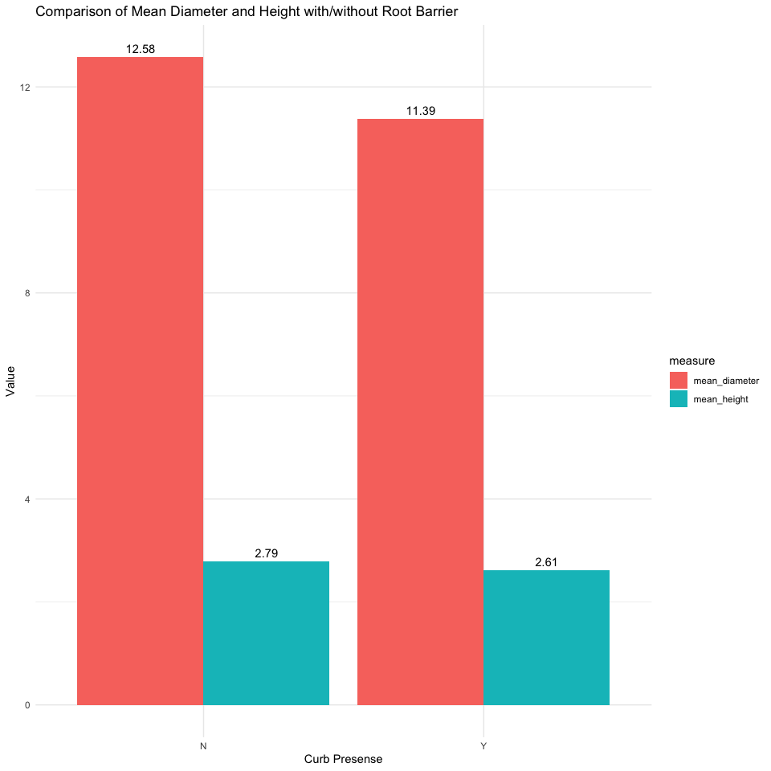<!-- -->

``` r
# Melt the data for easier plotting to street name
tree_stats_growth_street_side_long <- pivot_longer(tree_growth_street_side_stats, c(mean_diameter, mean_height), 
                                names_to = "measure", values_to = "value")
tree_stats_growth_street_side_long
```

    ## # A tibble: 12 × 3
    ##    street_side_name measure       value
    ##    <chr>            <chr>         <dbl>
    ##  1 BIKE MED         mean_diameter  3.01
    ##  2 BIKE MED         mean_height    1.32
    ##  3 EVEN             mean_diameter 11.5 
    ##  4 EVEN             mean_height    2.61
    ##  5 GREENWAY         mean_diameter 16.4 
    ##  6 GREENWAY         mean_height    3.4 
    ##  7 MED              mean_diameter  8.08
    ##  8 MED              mean_height    1.96
    ##  9 ODD              mean_diameter 11.7 
    ## 10 ODD              mean_height    2.68
    ## 11 PARK             mean_diameter  3.19
    ## 12 PARK             mean_height    1.05

``` r
# Plot
ggplot(tree_stats_growth_street_side_long, aes(x = street_side_name, y = value, fill = measure)) +
  geom_bar(stat = "identity", position = "dodge") +
  geom_text(aes(label = sprintf("%.2f", value)), position = position_dodge(width = 0.9), vjust = -0.5) +
  labs(title = "Comparison of Mean Diameter and Height with/without Root Barrier",
       y = "Value",
       x = "Street Side") +
  theme_minimal()
```

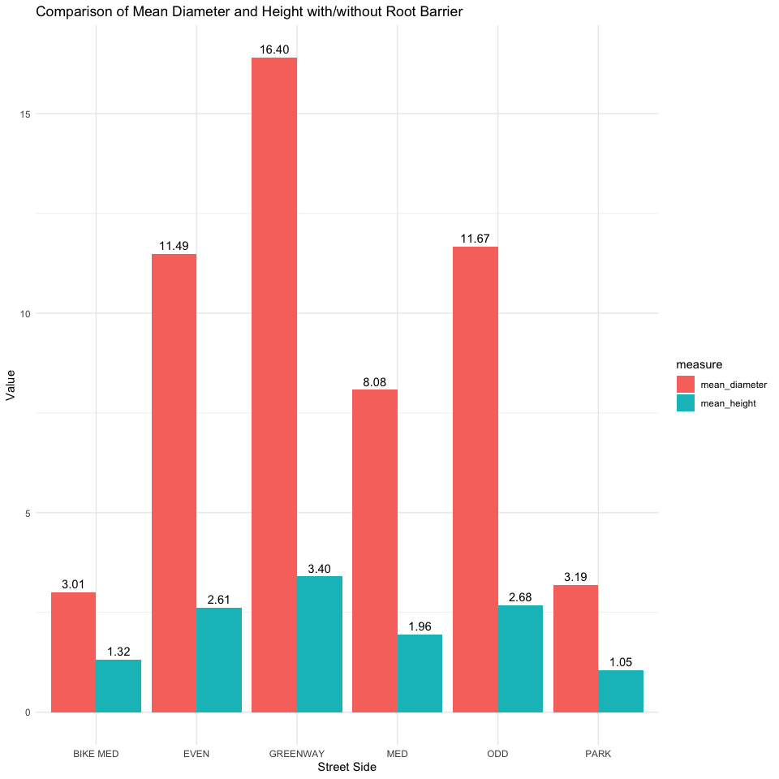<!-- -->

``` r
# Melt the data for easier plotting to street name
tree_stats_growth_ages_long <- pivot_longer(tree_growth_age_stats, c(mean_diameter, mean_height), 
                                names_to = "measure", values_to = "value")
tree_stats_growth_ages_long
```

    ## # A tibble: 64 × 3
    ##    tree_age measure       value
    ##       <dbl> <chr>         <dbl>
    ##  1        4 mean_diameter  3.07
    ##  2        4 mean_height    1.02
    ##  3        5 mean_diameter  3.07
    ##  4        5 mean_height    1.02
    ##  5        6 mean_diameter  3.05
    ##  6        6 mean_height    1.05
    ##  7        7 mean_diameter  3.11
    ##  8        7 mean_height    1.03
    ##  9        8 mean_diameter  3.21
    ## 10        8 mean_height    1.06
    ## # ℹ 54 more rows

``` r
# Plot
ggplot(tree_stats_growth_ages_long, aes(x = tree_age, y = value, fill = measure)) +
  geom_bar(stat = "identity", position = "dodge") +
  geom_text(aes(label = sprintf("%.2f", value)), position = position_dodge(width = 0.9), vjust = -0.5, size = 1.75) +
  labs(title = "Comparison of Mean Diameter and Height with/without Root Barrier",
       y = "Value",
       x = "Tree ages until 2023") +
  theme_minimal()
```

    ## Warning: Removed 2 rows containing missing values (`geom_bar()`).

    ## Warning: Removed 2 rows containing missing values (`geom_text()`).

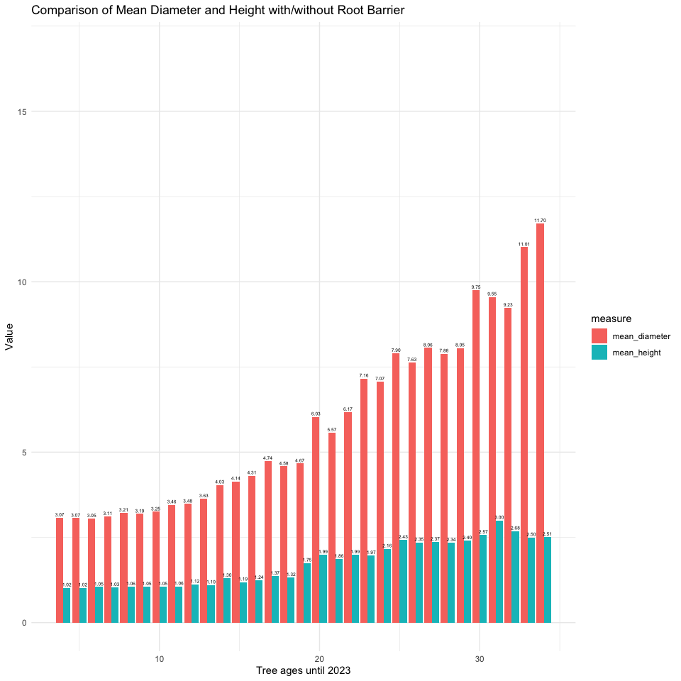<!-- -->

# Task 3: Modelling

## 3.0 (no points)

Pick a research question from 1.2, and pick a variable of interest
(we’ll call it “Y”) that’s relevant to the research question. Indicate
these.

<!-------------------------- Start your work below ---------------------------->

**Research Question**: *Is there a discernible correlation between the
diameter or height of trees and factors like the presence of a root
barrier(curb, ages, street side name)*

**Variable of interest**: *tree_growth_stats*

<!----------------------------------------------------------------------------->

## 3.1 (3 points)

Fit a model or run a hypothesis test that provides insight on this
variable with respect to the research question. Store the model object
as a variable, and print its output to screen. We’ll omit having to
justify your choice, because we don’t expect you to know about model
specifics in STAT 545.

- **Note**: It’s OK if you don’t know how these models/tests work. Here
  are some examples of things you can do here, but the sky’s the limit.

  - You could fit a model that makes predictions on Y using another
    variable, by using the `lm()` function.
  - You could test whether the mean of Y equals 0 using `t.test()`, or
    maybe the mean across two groups are different using `t.test()`, or
    maybe the mean across multiple groups are different using `anova()`
    (you may have to pivot your data for the latter two).
  - You could use `lm()` to test for significance of regression
    coefficients.

<!-------------------------- Start your work below ---------------------------->

``` r
# Fitting lm model on diameter based on tree_age
age_plant_diameter_lm <- lm(formula = diameter ~ tree_age , data = tree_growth_stats)
summary(age_plant_diameter_lm)
```

    ## 
    ## Call:
    ## lm(formula = diameter ~ tree_age, data = tree_growth_stats)
    ## 
    ## Residuals:
    ##    Min     1Q Median     3Q    Max 
    ##  -9.87  -2.11  -0.43   1.09 429.05 
    ## 
    ## Coefficients:
    ##             Estimate Std. Error t value Pr(>|t|)    
    ## (Intercept) 0.344905   0.045292   7.615 2.67e-14 ***
    ## tree_age    0.280171   0.002206 127.028  < 2e-16 ***
    ## ---
    ## Signif. codes:  0 '***' 0.001 '**' 0.01 '*' 0.05 '.' 0.1 ' ' 1
    ## 
    ## Residual standard error: 4.342 on 70061 degrees of freedom
    ##   (76548 observations deleted due to missingness)
    ## Multiple R-squared:  0.1872, Adjusted R-squared:  0.1872 
    ## F-statistic: 1.614e+04 on 1 and 70061 DF,  p-value: < 2.2e-16

``` r
# This is just for exploration on diameter based on height_range_id (not related too much to this specific question)
# But this gives a idea how height_range_id would relates to diameter
height_range_diameter_lm <- lm(formula = diameter ~ height_range_id , data = tree_growth_stats)
summary(height_range_diameter_lm) 
```

    ## 
    ## Call:
    ## lm(formula = diameter ~ height_range_id, data = tree_growth_stats)
    ## 
    ## Residuals:
    ##    Min     1Q Median     3Q    Max 
    ## -41.82  -3.18  -1.13   2.09 426.34 
    ## 
    ## Coefficients:
    ##                 Estimate Std. Error t value Pr(>|t|)    
    ## (Intercept)     -0.38587    0.03102  -12.44   <2e-16 ***
    ## height_range_id  4.52082    0.01018  444.04   <2e-16 ***
    ## ---
    ## Signif. codes:  0 '***' 0.001 '**' 0.01 '*' 0.05 '.' 0.1 ' ' 1
    ## 
    ## Residual standard error: 6.015 on 146609 degrees of freedom
    ## Multiple R-squared:  0.5735, Adjusted R-squared:  0.5735 
    ## F-statistic: 1.972e+05 on 1 and 146609 DF,  p-value: < 2.2e-16

<!----------------------------------------------------------------------------->

## 3.2 (3 points)

Produce something relevant from your fitted model: either predictions on
Y, or a single value like a regression coefficient or a p-value.

- Be sure to indicate in writing what you chose to produce.
- Your code should either output a tibble (in which case you should
  indicate the column that contains the thing you’re looking for), or
  the thing you’re looking for itself.
- Obtain your results using the `broom` package if possible. If your
  model is not compatible with the broom function you’re needing, then
  you can obtain your results by some other means, but first indicate
  which broom function is not compatible.

<!-------------------------- Start your work below ---------------------------->

**I will produce a p-value to determine if age is a eligible predictor
of the tree diameter.** **I will produce a p-value to determine if
height range id is a eligible predictor of the tree diameter.**

``` r
lm_tidy_age_plant_diameter <- broom::tidy(age_plant_diameter_lm)
age_plant_diameterp_values <- lm_tidy_age_plant_diameter$p.value
summary(age_plant_diameterp_values) #the p-value is greater than zero but very small
```

    ##      Min.   1st Qu.    Median      Mean   3rd Qu.      Max. 
    ## 0.000e+00 6.670e-15 1.334e-14 1.334e-14 2.001e-14 2.668e-14

``` r
lm_tidy_height_range_id_diameter <- broom::tidy(height_range_diameter_lm)
height_range_diameter_p_values <- lm_tidy_height_range_id_diameter$p.value
summary(height_range_diameter_p_values) #the p-value is greater than zero but very small
```

    ##      Min.   1st Qu.    Median      Mean   3rd Qu.      Max. 
    ## 0.000e+00 4.125e-36 8.249e-36 8.249e-36 1.237e-35 1.650e-35

<!----------------------------------------------------------------------------->

# Task 4: Reading and writing data

Get set up for this exercise by making a folder called `output` in the
top level of your project folder / repository. You’ll be saving things
there.

## 4.1 (3 points)

Take a summary table that you made from Task 1, and write it as a csv
file in your `output` folder. Use the `here::here()` function.

- **Robustness criteria**: You should be able to move your Mini Project
  repository / project folder to some other location on your computer,
  or move this very Rmd file to another location within your project
  repository / folder, and your code should still work.
- **Reproducibility criteria**: You should be able to delete the csv
  file, and remake it simply by knitting this Rmd file.

<!-------------------------- Start your work below ---------------------------->

**The varialbe is total_tree_species_per_neighborhoods in Task 1
Research Question 01**

``` r
# install.packages("here") 
library(here)
```

    ## here() starts at /Users/tongshuaizhang/mda-lurkstalker

``` r
library(readr)
# Define the directory path
output_path <- here("output")
# Create the directory if it doesn't exist
if (!dir.exists(output_path)) {
  dir.create(output_path)
}
csv_save_path <- here("output/total_tree_species_per_neighborhoods.csv")
write_csv(total_tree_species_per_neighborhoods, file = csv_save_path)
```

<!----------------------------------------------------------------------------->

## 4.2 (3 points)

Write your model object from Task 3 to an R binary file (an RDS), and
load it again. Be sure to save the binary file in your `output` folder.
Use the functions `saveRDS()` and `readRDS()`.

- The same robustness and reproducibility criteria as in 4.1 apply here.

<!-------------------------- Start your work below ---------------------------->

``` r
# Define the model path
age_model_output_path <- here("output", "age_plant_diameter_lm.rds" )
height_model_output_path <- here("output", "height_range_diameter_lm.rds" )

# write as RDS
saveRDS(age_plant_diameter_lm, file = age_model_output_path)
saveRDS(height_range_diameter_lm, file = height_model_output_path)

# read RDS
age_plant_diameter_lm_rds <- readRDS(age_model_output_path)
age_plant_diameter_lm_rds
```

    ## 
    ## Call:
    ## lm(formula = diameter ~ tree_age, data = tree_growth_stats)
    ## 
    ## Coefficients:
    ## (Intercept)     tree_age  
    ##      0.3449       0.2802

``` r
height_range_diameter_lm_rds <- readRDS(height_model_output_path)
height_range_diameter_lm_rds
```

    ## 
    ## Call:
    ## lm(formula = diameter ~ height_range_id, data = tree_growth_stats)
    ## 
    ## Coefficients:
    ##     (Intercept)  height_range_id  
    ##         -0.3859           4.5208

``` r
# Use identical to check if the read version rds is same as the original one in R format
identical(age_plant_diameter_lm_rds, age_plant_diameter_lm)
```

    ## [1] TRUE

``` r
identical(height_range_diameter_lm_rds, height_range_diameter_lm)
```

    ## [1] TRUE

<!----------------------------------------------------------------------------->

# Overall Reproducibility/Cleanliness/Coherence Checklist

Here are the criteria we’re looking for.

## Coherence (0.5 points)

The document should read sensibly from top to bottom, with no major
continuity errors.

The README file should still satisfy the criteria from the last
milestone, i.e. it has been updated to match the changes to the
repository made in this milestone.

## File and folder structure (1 points)

You should have at least three folders in the top level of your
repository: one for each milestone, and one output folder. If there are
any other folders, these are explained in the main README.

Each milestone document is contained in its respective folder, and
nowhere else.

Every level-1 folder (that is, the ones stored in the top level, like
“Milestone1” and “output”) has a `README` file, explaining in a sentence
or two what is in the folder, in plain language (it’s enough to say
something like “This folder contains the source for Milestone 1”).

## Output (1 point)

All output is recent and relevant:

- All Rmd files have been `knit`ted to their output md files.
- All knitted md files are viewable without errors on Github. Examples
  of errors: Missing plots, “Sorry about that, but we can’t show files
  that are this big right now” messages, error messages from broken R
  code
- All of these output files are up-to-date – that is, they haven’t
  fallen behind after the source (Rmd) files have been updated.
- There should be no relic output files. For example, if you were
  knitting an Rmd to html, but then changed the output to be only a
  markdown file, then the html file is a relic and should be deleted.

Our recommendation: delete all output files, and re-knit each
milestone’s Rmd file, so that everything is up to date and relevant.

## Tagged release (0.5 point)

You’ve tagged a release for Milestone 2.

### Attribution

Thanks to Victor Yuan for mostly putting this together.
